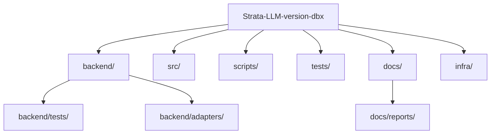

# Project Reorganization Plan

This plan aims to clean up the root directory and organize files into logical subdirectories.

## Current Root Directory Issues
- High number of `.py` script and test files in the root.
- Report files (`.pdf`, `.xlsx`, `.json`) cluttered in the root.
- Infrastructure files (`.service`, `.conf`) mixed with code.
- Backend directory has multiple `main_fixed.py` and test files mixed with logic.

## Proposed Structure

### Root Directory
- `/src` (Frontend - already exists)
- `/backend` (API and Business Logic)
- `/scripts` (Utility and one-off scripts)
- `/tests` (Integration and system tests)
- `/docs` (Reports, designs, and documentation)
- `/infra` (Nginx, systemd, and other config files)

## Detailed Actions

### 1. Documentation & Reports
Move the following to `/docs/reports/`:
- `enhanced_validation_report.pdf`
- `enhanced_validation_report.xlsx`
- `validation_report_export.json`
- `validation_report.json`
- `validation_report.pdf`
- `validation_report.xlsx`
- `FIX_COMPLETED.md` -> `/docs/`

### 2. Scripts
Move the following to `/scripts/`:
- `check_connections.py`
- `check_employee_data.py`
- `check_schema_details.py`
- `check_table_contents.py`
- `check_target_table.py`
- `quick_test.py`
- `temp_load.py`
- `temp_orcale_test.py`
- `tmp_oracle_test_onprem.py`
- `tmp_oracle_test.py`
- `tmp_rename_test.py`

### 3. Tests
Move the following to `/tests/`:
- `comprehensive_progress_test.py`
- `direct_db_test.py`
- `test_adapters.py`
- `test_analysis_filtering.py`
- `test_api_endpoint.py`
- `test_connections.py`
- `test_databricks_api.py`
- `test_databricks_fix.py`
- `test_databricks_introspection.py`
- `test_db.py`
- `test_filtering.py`
- `test_migration_simulation.py`
- `test_progress_endpoints.py`
- `test_row_count.py`
- `test_schema_structure.py`

### 4. Infrastructure
Move the following to `/infra/`:
- `myapp-backend.service`
- `nginx.conf`

### 5. Backend Cleanup
- Move `backend/test_*.py` and `backend/verify_fix.py` to `backend/tests/`.
- Decide if `main_fixed.py` should replace `main.py` or be archived.

## Mermaid Diagram of Proposed Structure

## Impact Assessment
- **Paths**: Any scripts that use relative paths to `.env` or other files will need updates.
- **Imports**: Moving backend tests might require `sys.path` adjustments or running with `python -m pytest`.
- **References**: `package.json` or `README.md` might reference these files.

I will wait for your approval before proceeding with these moves.